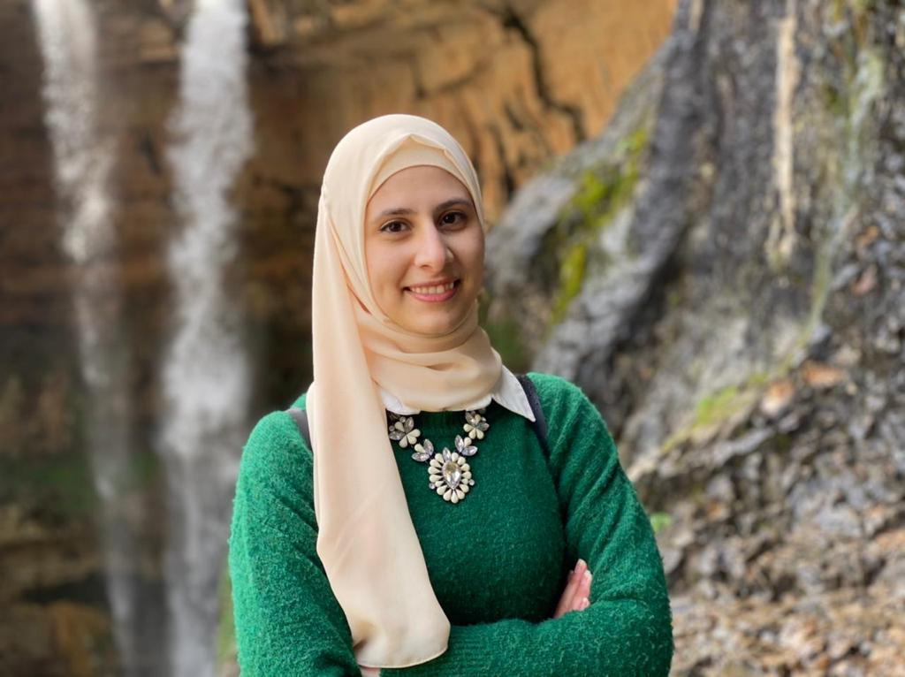

# 
Fatima Katrib 

fatimakatrib19@gmail.com | [LinkedIn](https://www.linkedin.com/in/fatima-katrib-0795b8102/ "fatima-katrib") |
Tripoli, Lebanon

 

### **Technical Skills**

**Languages:** Html/Css/JavaScript  
**Technologies:** React.js  
**Frameworks:** Css frameworks (Chakra UI)

### **Technical Skills**

- Good teamwork skills
- Strong communication skills
- Good agile methodology
- Strong analytical skills

### **WORK EXPERIENCE**

**Shift Innovation Hub**  
_Mentor_  
September 2020 – Present

- Supported and encouraged the professional development of Makani Project beneficiaries.
- Introduced the program to the mentees and the business owners.
- Provided 4 months active career guidance before, during and after the On-The-Job training.
- Provided the mentees with the essential information about decent work and Lebanese Labor Law.
- Provided a monthly report.
- 12 out of 30 mentees were a success story who either got a job or opened their own small business

_Trainer_  
June 2022

- Provided “Social Entrepreneurship” training to 2 groups of 50 women each at West Beqaa.
- Provided “Leadership and Advocacy” training to 3 groups of 20 youths each at Shift.
- Organized and Improved existing training materials to ensure consistency and quality of content and delivery according to each group's capabilities.
   

**Take The Lead Project/ACCESS Alumni Mini Grant Project**  
_Employability and Professional development Project Coordinator_  
March – June 2022

- Maintained and monitored the project plan, training schedules, budget.
- Attended relevant meetings with Teach for Lebanon.
- Collected and monitored data and submitted reports.
- Communicated and followed up with trainers and trainees.
- Supported in the outreach and participants selection.
   

### **EDUCATION**

**Lebanese international university**  
Teaching Diploma in Education  
June 2020

**Lebanese American university**  
Bachelor of Science in Chemistry  
January 2018  
_Full Scholarship funded by USAID under USP Program_

### **LANGUAGES:**

Arabic (Native), English (profecient), French (Intermediate)
